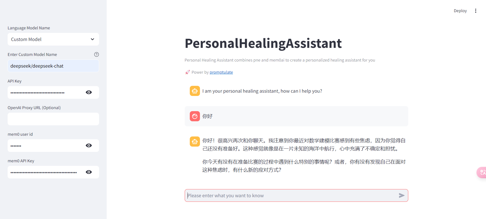

# Build a Personal Healing Assistant using Streamlit and Mem0

This demo shows how to use `pne.chat()` and `mem0` to create a Personal Healing Assistant with memory capabilities. For the application frontend, we'll be using Streamlit, an easy-to-use open-source Python framework.

This application serves as a template, allowing you to create your own LLM application with memory features.

You can try the live demo at [https://pne-mem0.streamlit.app/](https://pne-mem0.streamlit.app/) or see the code [here](https://github.com/Undertone0809/promptulate/tree/main/example/mem0).

<script setup>
import IFrame from '/components/iframe.vue'
</script>

<IFrame src="https://pne-mem0.streamlit.app/?embed=true" />

## Output Effect

When you run the application, you'll see an interface similar to the following:



The Mem0 platform allows the assistant to access historical chat records, enabling it to create personalized AI assistants for different users:


## Step-by-Step Implementation

### Environment Setup

First, let's install all necessary libraries:

```bash
pip install -U pne streamlit mem0ai
```

### Create the PersonalHealingAssistant class

Create a `core.py` script and implement the `PersonalHealingAssistant` class:

```python
import pne
from mem0 import MemoryClient

class PersonalHealingAssistant:
    def __init__(self):
        self.memory = None
        self.messages = [
            {"role": "system", "content": "You are a personal healing AI Assistant."}
        ]

    def set_mem0_api_key(self, mem0_api_key: str):
        self.memory = MemoryClient(api_key=mem0_api_key)

    def ask_question(self, question: str, user_id: str, config) -> str:
        previous_memories = self.search_memories(question, user_id=user_id)
        prompt = question
        if previous_memories:
            prompt = f"User input: {question}\n Previous memories: {previous_memories}"
        self.messages.append({"role": "user", "content": prompt})

        response = pne.chat(
            model=config.model_name,
            stream=True,
            messages=self.messages,
            model_config={"api_base": config.api_base, "api_key": config.api_key},
        )
        self.messages.append({"role": "assistant", "content": response})

        self.memory.add(question, user_id=user_id)
        return response

    def get_memories(self, user_id):
        return self.memory.get_all(user_id=user_id)

    def search_memories(self, query, user_id):
        return self.memory.search(query, user_id=user_id)
```

### Create the Streamlit app

Create an `app.py` file and set up the Streamlit interface:

```python
import pne
import streamlit as st
from core import PersonalHealingAssistant

def main():
    config = pne.beta.st.model_sidebar()
    with st.sidebar:
        mem0_user_id = st.text_input("mem0 user id", type="password")
        mem0_api_key = st.text_input("mem0 API Key", key="provider_mem0_api_key", type="password")

    st.title("💬 Personal Healing Assistant")
    st.caption("🚀 Hi there! 👋 I am a personal healing assistant powered by Promptulate and Mem0.")

    ai_assistant = PersonalHealingAssistant()

    if "messages" not in st.session_state:
        st.session_state["messages"] = [
            {"role": "assistant", "content": "How can I help you with your healing journey today?"}
        ]

    for msg in st.session_state.messages:
        st.chat_message(msg["role"]).write(msg["content"])

    if prompt := st.chat_input("How can I assist you?"):
        if not config.api_key:
            st.info("Please add your model API key to continue.")
            st.stop()

        if not mem0_api_key:
            st.error("Please provide your mem0 API Key to continue.")
            st.stop()

        ai_assistant.set_mem0_api_key(mem0_api_key)

        st.session_state.messages.append({"role": "user", "content": prompt})
        st.chat_message("user").write(prompt)

        with st.chat_message("assistant"):
            response = ai_assistant.ask_question(
                question=prompt, user_id=mem0_user_id, config=config
            )
            st.write_stream(response)
        st.session_state.messages.append({"role": "assistant", "content": response})

if __name__ == "__main__":
    main()
```

### Run the application

To run the application, use the following command:

```shell
streamlit run app.py
```

## How to write model name?

If you want to custom your model, you can see how to write model names here: [How to write model name?](/other/how_to_write_model_name)


## Run the demo

You can find the project [here](https://github.com/Undertone0809/promptulate/tree/main/example/mem0). To run the application, follow these steps:

1. Fork the project by clicking [here](https://github.com/Undertone0809/promptulate/fork).
2. Clone the project locally:

   ```bash
   git clone https://github.com/Undertone0809/promptulate.git
   ```

3. Switch to the example directory:

   ```shell
   cd ./example/mem0
   ```

4. Install the dependencies:

   ```shell
   pip install -r requirements.txt
   ```

5. Run the application:

   ```shell
   streamlit run app.py
   ```

By following these instructions, you can easily set up and run your own Personal Healing Assistant using pne, Streamlit, and Mem0. This assistant will be able to remember past interactions and provide personalized responses based on the user's history.

Enjoy building your AI-powered healing companion!
